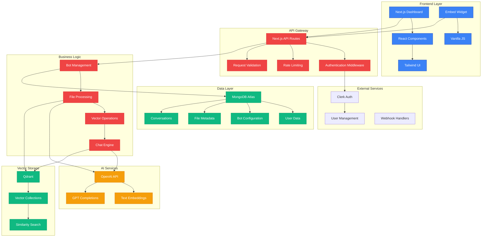
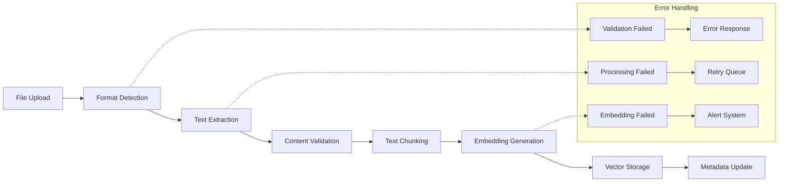
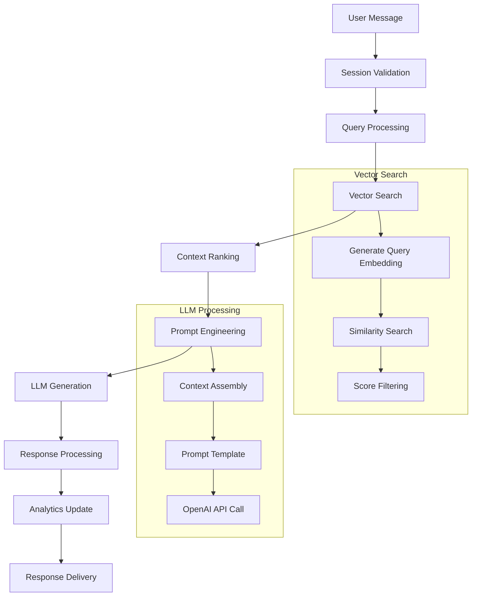
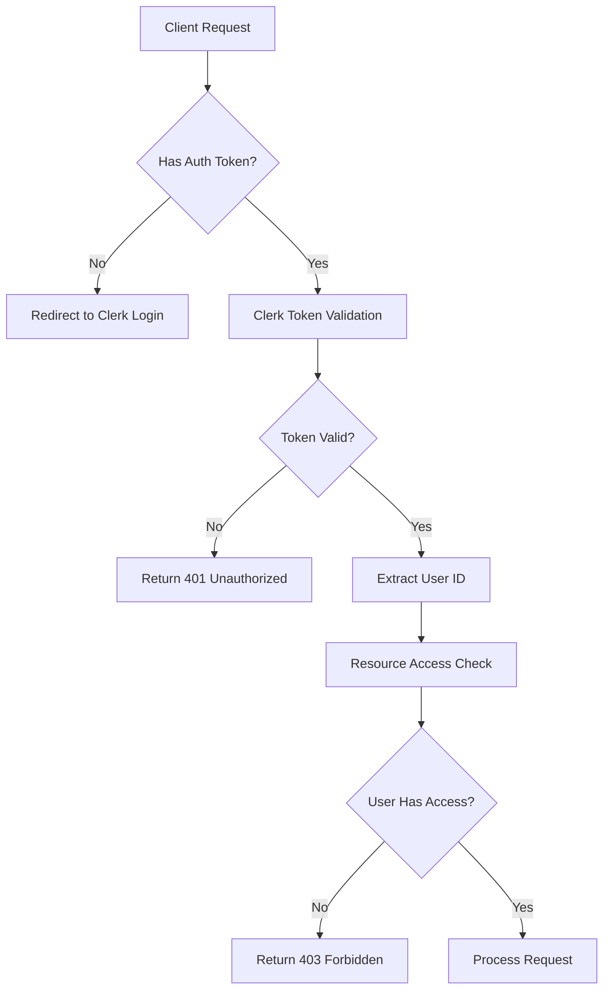

# 🏗️ PlugRAG Architecture Deep Dive

> **Complete technical overview of the PlugRAG platform architecture, design decisions, and implementation details**

## 📋 **Table of Contents**
- [System Overview](#system-overview)
- [Application Architecture](#application-architecture)
- [Data Flow & Processing](#data-flow--processing)
- [Database Design](#database-design)
- [Vector Storage System](#vector-storage-system)
- [AI & RAG Pipeline](#ai--rag-pipeline)
- [Security Architecture](#security-architecture)
- [Performance & Scalability](#performance--scalability)
- [Deployment Architecture](#deployment-architecture)

---

## 🎯 **System Overview**

PlugRAG is built as a modern, cloud-native SaaS platform using a **serverless-first architecture** with **microservices patterns** implemented through Next.js API routes.

### **Core Design Principles**
- **Multi-tenancy**: Complete data isolation between users
- **Scalability**: Horizontal scaling through stateless services  
- **Security**: Zero-trust security model with encrypted data
- **Performance**: Sub-second response times with intelligent caching
- **Reliability**: 99.9% uptime with graceful error handling
- **Developer Experience**: TypeScript-ready with comprehensive APIs

### **High-Level Architecture**



---

## 🛠️ **Application Architecture**

### **Frontend Architecture**

#### **Next.js App Router Structure**
```
src/app/
├── layout.js              # Root layout with providers
├── page.js                # Landing page (marketing)
├── globals.css            # Global styles and Tailwind
├── middleware.js          # Route protection and auth
└── dashboard/             # Protected application area
    ├── layout.js         # Dashboard layout with navigation
    ├── page.js           # Dashboard overview
    ├── bots/
    │   ├── page.js       # Bot listing with search/filter
    │   ├── [id]/
    │   │   ├── page.js   # Bot management interface
    │   │   └── embed/
    │   │       └── page.js # Embed code generator
    │   └── create-bot/
    │       └── page.js   # Bot creation wizard
    ├── analytics/
    │   └── page.js       # Analytics dashboard
    └── settings/
        └── page.js       # User settings
```

#### **Component Architecture**
```
src/components/
├── layout/
│   ├── DashboardLayout.js    # Sidebar navigation layout
│   ├── Navigation.js         # Main navigation component
│   └── MobileMenu.js         # Responsive mobile navigation
├── ui/                       # Reusable UI components
│   ├── Button.js
│   ├── Input.js
│   ├── Modal.js
│   └── LoadingSpinner.js
├── forms/
│   ├── BotCreateForm.js
│   ├── FileUploadForm.js
│   └── SettingsForm.js
├── FileUpload.js             # Drag & drop file upload
└── ChatInterface.js          # Chat preview component
```

#### **State Management Strategy**
```javascript
// Custom hooks for API integration
src/hooks/
├── useAPI.js               # Base API hook with error handling
├── useBots.js              # Bot CRUD operations
├── useFiles.js             # File management
├── useAuth.js              # Authentication state
└── useWebSocket.js         # Real-time connections (planned)

// Local state patterns
// 1. Server state via SWR/React Query (planned)
// 2. UI state via React hooks
// 3. Form state via controlled components
// 4. Global state via Context API (minimal)
```

### **Backend Architecture**

#### **API Route Structure**
```
src/app/api/
├── auth/                   # Authentication utilities
├── bots/                   # Bot management endpoints
│   ├── route.js           # GET /api/bots, POST /api/bots
│   └── [id]/
│       ├── route.js       # GET/PATCH/DELETE /api/bots/[id]
│       ├── analytics/
│       │   └── route.js   # GET /api/bots/[id]/analytics
│       └── api-keys/
│           └── route.js   # Custom OpenAI key management
├── files/                  # File processing endpoints
│   ├── route.js           # GET/POST /api/files
│   ├── [id]/
│   │   └── route.js       # GET/DELETE /api/files/[id]
│   ├── info/
│   │   └── route.js       # GET /api/files/info (metadata)
│   └── url/
│       └── route.js       # POST /api/files/url (URL processing)
├── vectors/                # Vector operations
│   ├── route.js           # GET /api/vectors (health check)
│   ├── [botId]/
│   │   └── route.js       # Bot-specific vector operations
│   └── process/
│       └── [fileId]/
│           └── route.js   # File-to-vector processing
├── chat/                   # Public chat endpoints
│   └── [botId]/
│       └── route.js       # POST/GET/DELETE chat operations
└── webhooks/               # External service webhooks
    ├── clerk/
    │   └── route.js       # Clerk user lifecycle events
    └── stripe/
        └── route.js       # Payment webhooks (planned)
```

#### **Service Layer Architecture**
```
src/lib/
├── core/                   # Core business logic
│   ├── botService.js      # Bot management operations
│   ├── fileService.js     # File processing logic
│   ├── chatService.js     # Chat and conversation handling
│   └── analyticsService.js # Analytics and metrics
├── integrations/           # External service integrations
│   ├── openai.js          # OpenAI API client
│   ├── qdrant.js          # Qdrant vector database client
│   ├── clerk.js           # Clerk authentication utilities
│   └── mongo.js           # MongoDB connection and utilities
├── processors/             # Document processing pipeline
│   ├── textExtractor.js   # Universal text extraction
│   ├── chunker.js         # Text segmentation
│   ├── embeddings.js      # Embedding generation
│   └── validator.js       # Input validation
└── utils/                  # Shared utilities
    ├── apiResponse.js      # Standardized API responses
    ├── encryption.js       # Data encryption utilities
    ├── performance.js      # Performance monitoring
    └── logger.js           # Structured logging
```

---

## 🔄 **Data Flow & Processing**

### **Document Processing Pipeline**



#### **Detailed Processing Flow**

1. **File Upload & Validation**
   ```javascript
   // 1. Validate file format and size
   const validationResult = validateFile(file, {
     maxSize: 50 * 1024 * 1024, // 50MB
     allowedTypes: ['pdf', 'docx', 'txt', 'csv', 'html']
   });

   // 2. Generate unique filename and store metadata
   const fileRecord = await File.create({
     originalName: file.originalname,
     filename: generateUniqueFilename(file.originalname),
     fileSize: file.size,
     mimeType: file.mimetype,
     botId: botId,
     status: 'uploading'
   });
   ```

2. **Text Extraction**
   ```javascript
   // Format-specific extraction
   const extractors = {
     'application/pdf': extractFromPDF,
     'application/vnd.openxmlformats-officedocument.wordprocessingml.document': extractFromDOCX,
     'text/plain': extractFromText,
     'text/csv': extractFromCSV,
     'text/html': extractFromHTML
   };

   const extractedText = await extractors[file.mimeType](fileBuffer);
   ```

3. **Text Chunking**
   ```javascript
   // Intelligent chunking with overlap
   const chunks = await chunkText(extractedText, {
     chunkSize: 700,        // Target chunk size
     overlap: 100,          // Overlap between chunks
     preserveStructure: true, // Respect paragraphs and sections
     minChunkSize: 200      // Minimum viable chunk size
   });
   ```

4. **Embedding Generation**
   ```javascript
   // Batch embedding generation for efficiency
   const embeddings = await Promise.allSettled(
     chunks.map(async (chunk) => {
       const embedding = await openai.embeddings.create({
         model: 'text-embedding-3-small',
         input: chunk.content
       });
       return {
         chunkId: chunk.id,
         vector: embedding.data[0].embedding,
         tokens: embedding.usage.total_tokens
       };
     })
   );
   ```

5. **Vector Storage**
   ```javascript
   // Store in Qdrant with metadata
   await qdrantClient.upsert(collectionName, {
     points: embeddings.map(emb => ({
       id: emb.chunkId,
       vector: emb.vector,
       payload: {
         fileId: file.id,
         fileName: file.filename,
         chunkContent: chunks.find(c => c.id === emb.chunkId).content,
         metadata: chunk.metadata
       }
     }))
   });
   ```

### **Chat & RAG Pipeline**



#### **RAG Implementation Details**

1. **Query Processing**
   ```javascript
   async function processQuery(message, sessionId, botId) {
     // 1. Generate query embedding
     const queryEmbedding = await generateEmbedding(message);
     
     // 2. Perform similarity search
     const searchResults = await vectorSearch(botId, queryEmbedding, {
       limit: 5,
       scoreThreshold: 0.7
     });
     
     // 3. Rank and filter results
     const relevantContext = rankAndFilterResults(searchResults, message);
     
     return { queryEmbedding, relevantContext };
   }
   ```

2. **Context Assembly**
   ```javascript
   function assembleContext(relevantChunks, query) {
     const context = relevantChunks
       .map(chunk => `Document: ${chunk.fileName}\nContent: ${chunk.content}`)
       .join('\n\n');
     
     return {
       systemPrompt: `You are a helpful AI assistant. Use the provided context to answer questions accurately.`,
       context: context,
       hasRelevantContext: relevantChunks.length > 0
     };
   }
   ```

3. **Response Generation**
   ```javascript
   async function generateResponse(query, context, botInfo) {
     const messages = [
       {
         role: 'system',
         content: `You are ${botInfo.name}. ${botInfo.description}\n\nContext: ${context.context}`
       },
       {
         role: 'user',
         content: query
       }
     ];
     
     const completion = await openai.chat.completions.create({
       model: 'gpt-4',
       messages: messages,
       temperature: 0.7,
       max_tokens: 500
     });
     
     return {
       content: completion.choices[0].message.content,
       tokensUsed: completion.usage.total_tokens,
       hasRelevantContext: context.hasRelevantContext
     };
   }
   ```

---

## 🗄️ **Database Design**

### **MongoDB Schema Architecture**

#### **User Collection**
```javascript
// User.js - User profiles and settings
{
  _id: ObjectId,
  clerkId: String,           // Clerk authentication ID
  email: String,
  firstName: String,
  lastName: String,
  plan: 'free' | 'pro' | 'enterprise',
  usage: {
    botsCreated: Number,
    messagesThisMonth: Number,
    storageUsed: Number,     // in bytes
    lastResetDate: Date
  },
  limits: {
    maxBots: Number,
    maxMessages: Number,
    maxStorage: Number
  },
  preferences: {
    emailNotifications: Boolean,
    marketingEmails: Boolean
  },
  subscription: {
    status: String,
    stripeCustomerId: String,
    stripeSubscriptionId: String,
    currentPeriodStart: Date,
    currentPeriodEnd: Date
  },
  createdAt: Date,
  updatedAt: Date
}
```

#### **Bot Collection**
```javascript
// Bot.js - Bot configurations and analytics
{
  _id: ObjectId,
  ownerId: String,           // Clerk user ID
  name: String,
  description: String,
  botKey: String,            // Unique public identifier
  status: 'active' | 'inactive' | 'suspended',
  
  // Appearance customization
  customization: {
    bubbleColor: String,     // Hex color
    position: 'bottom-right' | 'bottom-left' | 'top-right' | 'top-left',
    greeting: String,
    placeholder: String,
    title: String
  },
  
  // Vector storage configuration
  vectorStorage: {
    enabled: Boolean,
    provider: 'qdrant',
    collectionName: String,
    dimensions: Number,
    model: String,
    createdAt: Date,
    deletedAt: Date
  },
  
  // Analytics tracking
  analytics: {
    totalMessages: Number,
    totalSessions: Number,
    totalEmbeddings: Number,
    totalTokensUsed: Number,
    lastActiveAt: Date,
    averageSessionLength: Number,
    uniqueVisitors: Number
  },
  
  // Usage limits
  limits: {
    maxFilesPerBot: Number,
    maxFileSize: Number,
    messagesPerMonth: Number,
    sessionTimeoutMinutes: Number,
    maxSessionsPerDay: Number
  },
  
  // API configuration for custom keys
  apiConfiguration: {
    openaiConfig: {
      apiKeyEncrypted: String,
      keyStatus: 'none' | 'valid' | 'invalid' | 'expired',
      lastValidated: Date,
      usage: {
        totalTokens: Number,
        embedTokens: Number,
        chatTokens: Number
      },
      models: {
        chat: String,
        embeddings: String
      }
    },
    fallbackToGlobal: Boolean
  },
  
  // Domain restrictions
  domainWhitelist: [String],
  
  // Legacy fields for backward compatibility
  fileCount: Number,
  totalTokens: Number,
  
  createdAt: Date,
  updatedAt: Date
}
```

#### **File Collection**
```javascript
// File.js - File metadata and processing results
{
  _id: ObjectId,
  botId: ObjectId,
  ownerId: String,
  
  // File information
  filename: String,          // Stored filename
  originalName: String,      // Original upload name
  fileSize: Number,
  mimeType: String,
  fileHash: String,          // For deduplication
  
  // Processing status
  status: 'uploading' | 'processing' | 'completed' | 'failed',
  processingStage: String,   // Current processing step
  
  // Processing results
  processingResult: {
    chunksCreated: Number,
    embeddingsGenerated: Number,
    tokensUsed: Number,
    processingTime: Number,  // milliseconds
    errors: [String],
    metadata: Object
  },
  
  // Processing options
  options: {
    generateEmbeddings: Boolean,
    chunkSize: Number,
    overlap: Number,
    customMetadata: Object
  },
  
  uploadedAt: Date,
  processedAt: Date,
  deletedAt: Date
}
```

#### **Conversation Collection**
```javascript
// Conversation.js - Chat sessions and messages
{
  _id: ObjectId,
  botId: ObjectId,
  sessionId: String,         // Client-generated session ID
  
  // User identification (anonymous)
  userFingerprint: String,
  userAgent: String,
  ipAddress: String,
  
  // Session context
  domain: String,
  referrer: String,
  
  // Messages in conversation
  messages: [{
    _id: ObjectId,
    role: 'user' | 'assistant',
    content: String,
    timestamp: Date,
    tokens: Number,
    responseTime: Number,    // for assistant messages
    model: String,           // AI model used
    sources: [{              // for assistant messages
      documentId: ObjectId,
      chunkId: ObjectId,
      fileName: String,
      chunkContent: String,
      similarityScore: Number,
      retrievedAt: Date
    }],
    hasRelevantContext: Boolean,
    metadata: Object
  }],
  
  status: 'active' | 'ended',
  
  // Calculated statistics
  totalMessages: Number,
  totalTokens: Number,
  lastMessageAt: Date,
  
  createdAt: Date,
  updatedAt: Date
}
```

#### **Chunk Collection**
```javascript
// Chunk.js - Text chunks for vector storage
{
  _id: ObjectId,
  fileId: ObjectId,
  botId: ObjectId,
  
  // Chunk content
  content: String,
  tokens: Number,
  chunkIndex: Number,        // Order within file
  
  // Vector information
  hasEmbedding: Boolean,
  embeddingModel: String,
  vectorId: String,          // Qdrant vector ID
  
  // Metadata for enhanced search
  metadata: {
    page: Number,            // For PDFs
    section: String,         // Document section
    title: String,           // Chunk title
    category: String,        // Content category
    language: String,        // Content language
    customFields: Object     // User-defined metadata
  },
  
  createdAt: Date
}
```

### **Database Indexing Strategy**

```javascript
// Performance-critical indexes
const indexes = [
  // User queries
  { "clerkId": 1 },                    // User lookup
  
  // Bot queries
  { "ownerId": 1, "status": 1 },       // User's active bots
  { "botKey": 1 },                     // Public bot access
  { "ownerId": 1, "createdAt": -1 },   // Recent bots
  
  // File queries
  { "botId": 1, "status": 1 },         // Bot's processed files
  { "ownerId": 1, "uploadedAt": -1 },  // Recent uploads
  { "fileHash": 1 },                   // Deduplication
  
  // Conversation queries
  { "botId": 1, "sessionId": 1 },      // Session lookup
  { "botId": 1, "createdAt": -1 },     // Recent conversations
  { "userFingerprint": 1, "botId": 1 }, // User tracking
  
  // Chunk queries
  { "fileId": 1, "chunkIndex": 1 },    // File chunks
  { "botId": 1, "hasEmbedding": 1 },   // Bot vectors
  { "vectorId": 1 }                    // Vector lookup
];
```

---

## 🔍 **Vector Storage System**

### **Qdrant Collection Architecture**

```javascript
// Collection naming convention: {userId}_{botId}
const collectionName = `${userId}_${botId}`;

// Collection configuration
const collectionConfig = {
  vectors: {
    size: 1536,              // text-embedding-3-small
    distance: "Cosine"       // Similarity metric
  },
  optimizers_config: {
    default_segment_number: 2,
    max_segment_size: 20000,
    memmap_threshold: 50000,
    indexing_threshold: 20000,
    flush_interval_sec: 30,
    max_optimization_threads: 2
  },
  wal_config: {
    wal_capacity_mb: 32,
    wal_segments_ahead: 0
  }
};
```

### **Vector Point Structure**

```javascript
// Vector point schema in Qdrant
{
  id: "chunk_uuid",           // Unique chunk identifier
  vector: [0.1, -0.2, ...],  // 1536-dimensional embedding
  payload: {
    // Core identifiers
    fileId: "file_uuid",
    fileName: "document.pdf",
    botId: "bot_uuid",
    chunkIndex: 0,
    
    // Content
    chunkContent: "Full text content of the chunk...",
    tokens: 67,
    
    // Metadata for enhanced search
    metadata: {
      page: 5,
      section: "Introduction",
      title: "Getting Started",
      category: "documentation",
      language: "en",
      documentType: "pdf",
      uploadDate: "2025-01-15T10:30:00Z"
    },
    
    // Search optimization
    keywords: ["password", "reset", "account"],
    contentHash: "sha256_hash",
    
    // Quality metrics
    contentQuality: 0.85,     // Automated quality score
    readability: 0.78,        // Text readability score
    
    // Custom fields
    customFields: {
      priority: "high",
      department: "support",
      version: "2.1"
    }
  }
}
```

### **Search Implementation**

```javascript
class VectorSearchService {
  async semanticSearch(botId, query, options = {}) {
    const {
      limit = 5,
      scoreThreshold = 0.7,
      filter = {},
      includeMetadata = true
    } = options;
    
    // 1. Generate query embedding
    const queryEmbedding = await this.generateEmbedding(query);
    
    // 2. Build search filter
    const searchFilter = this.buildSearchFilter(botId, filter);
    
    // 3. Perform vector search
    const searchResult = await this.qdrantClient.search(
      this.getCollectionName(botId),
      {
        vector: queryEmbedding,
        limit: limit * 2,        // Search more, filter later
        with_payload: includeMetadata,
        filter: searchFilter,
        score_threshold: scoreThreshold * 0.8  // Lower threshold for initial search
      }
    );
    
    // 4. Re-rank and filter results
    const rankedResults = await this.reRankResults(
      searchResult.points,
      query,
      scoreThreshold
    );
    
    // 5. Return top results
    return rankedResults.slice(0, limit);
  }
  
  buildSearchFilter(botId, userFilter) {
    const filter = {
      must: [
        { key: "botId", match: { value: botId } }
      ]
    };
    
    // Add user filters
    if (userFilter.category) {
      filter.must.push({
        key: "metadata.category",
        match: { value: userFilter.category }
      });
    }
    
    if (userFilter.fileTypes) {
      filter.must.push({
        key: "metadata.documentType",
        match: { any: userFilter.fileTypes }
      });
    }
    
    if (userFilter.dateRange) {
      filter.must.push({
        key: "metadata.uploadDate",
        range: {
          gte: userFilter.dateRange.start,
          lte: userFilter.dateRange.end
        }
      });
    }
    
    return filter;
  }
  
  async reRankResults(results, query, threshold) {
    // Implement semantic re-ranking
    const reranked = results.map(result => {
      // Calculate additional relevance scores
      const keywordScore = this.calculateKeywordRelevance(query, result.payload);
      const contextScore = this.calculateContextRelevance(query, result.payload);
      
      // Combine scores
      const combinedScore = (
        result.score * 0.6 +           // Vector similarity (60%)
        keywordScore * 0.2 +           // Keyword matching (20%)
        contextScore * 0.2             // Context relevance (20%)
      );
      
      return {
        ...result,
        combinedScore,
        originalScore: result.score
      };
    });
    
    // Filter by combined threshold and sort
    return reranked
      .filter(r => r.combinedScore >= threshold)
      .sort((a, b) => b.combinedScore - a.combinedScore);
  }
}
```

---

## 🤖 **AI & RAG Pipeline**

### **Embedding Strategy**

```javascript
class EmbeddingService {
  constructor() {
    this.models = {
      small: 'text-embedding-3-small',    // 1536 dimensions, faster
      large: 'text-embedding-3-large'     // 3072 dimensions, more accurate
    };
    this.defaultModel = this.models.small;
  }
  
  async generateEmbedding(text, options = {}) {
    const {
      model = this.defaultModel,
      dimensions = 1536,
      maxRetries = 3
    } = options;
    
    try {
      // Preprocess text
      const processedText = this.preprocessText(text);
      
      // Generate embedding with retry logic
      const response = await this.retryOperation(async () => {
        return await this.openai.embeddings.create({
          model: model,
          input: processedText,
          dimensions: dimensions
        });
      }, maxRetries);
      
      return {
        vector: response.data[0].embedding,
        tokensUsed: response.usage.total_tokens,
        model: model,
        dimensions: dimensions
      };
      
    } catch (error) {
      throw new EmbeddingError(`Failed to generate embedding: ${error.message}`);
    }
  }
  
  preprocessText(text) {
    // Clean and normalize text for better embeddings
    return text
      .replace(/\s+/g, ' ')           // Normalize whitespace
      .replace(/[^\w\s.,!?-]/g, '')   // Remove special characters
      .trim()
      .slice(0, 8191);                // OpenAI token limit
  }
  
  async batchEmbeddings(texts, options = {}) {
    const batchSize = 100;            // OpenAI batch limit
    const batches = this.chunkArray(texts, batchSize);
    const results = [];
    
    for (const batch of batches) {
      const batchResult = await this.openai.embeddings.create({
        model: options.model || this.defaultModel,
        input: batch.map(text => this.preprocessText(text))
      });
      
      results.push(...batchResult.data);
    }
    
    return results;
  }
}
```

### **Conversation Management**

```javascript
class ConversationService {
  async processMessage(botId, message, sessionId, userContext) {
    const startTime = Date.now();
    
    try {
      // 1. Load or create conversation
      let conversation = await this.getOrCreateConversation(
        botId, sessionId, userContext
      );
      
      // 2. Add user message
      const userMessage = await this.addUserMessage(conversation, message);
      
      // 3. Generate AI response using RAG
      const aiResponse = await this.generateAIResponse(
        botId, message, conversation.messages
      );
      
      // 4. Add assistant message
      const assistantMessage = await this.addAssistantMessage(
        conversation, aiResponse
      );
      
      // 5. Update conversation analytics
      await this.updateConversationAnalytics(conversation);
      
      // 6. Update bot analytics
      await this.updateBotAnalytics(botId, {
        newMessage: true,
        newSession: conversation.messages.length === 2,
        tokensUsed: aiResponse.tokensUsed
      });
      
      const responseTime = Date.now() - startTime;
      
      return {
        message: assistantMessage.content,
        sessionId: sessionId,
        messageId: assistantMessage._id,
        conversationId: conversation._id,
        sources: assistantMessage.sources,
        responseTime: responseTime,
        tokensUsed: aiResponse.tokensUsed,
        hasRelevantContext: aiResponse.hasRelevantContext
      };
      
    } catch (error) {
      await this.handleConversationError(botId, sessionId, error);
      throw error;
    }
  }
  
  async generateAIResponse(botId, query, conversationHistory) {
    // 1. Get bot configuration
    const bot = await this.getBotConfiguration(botId);
    
    // 2. Perform RAG search
    const searchResults = await this.vectorSearchService.semanticSearch(
      botId, query, {
        limit: 5,
        scoreThreshold: 0.7
      }
    );
    
    // 3. Prepare context
    const context = this.prepareRAGContext(searchResults, conversationHistory);
    
    // 4. Generate response
    const completion = await this.generateCompletion(bot, query, context);
    
    return {
      content: completion.choices[0].message.content,
      tokensUsed: completion.usage.total_tokens,
      model: completion.model,
      sources: this.formatSources(searchResults),
      hasRelevantContext: searchResults.length > 0,
      responseTime: completion.responseTime
    };
  }
  
  prepareRAGContext(searchResults, conversationHistory) {
    // Prepare context from search results
    const documentContext = searchResults
      .map(result => ({
        content: result.payload.chunkContent,
        source: result.payload.fileName,
        relevance: result.score
      }))
      .filter(ctx => ctx.relevance > 0.7)
      .slice(0, 3)  // Top 3 most relevant
      .map(ctx => `Source: ${ctx.source}\nContent: ${ctx.content}`)
      .join('\n\n');
    
    // Prepare conversation context (last 3 exchanges)
    const recentHistory = conversationHistory
      .slice(-6)  // Last 6 messages (3 exchanges)
      .map(msg => `${msg.role}: ${msg.content}`)
      .join('\n');
    
    return {
      documentContext,
      conversationContext: recentHistory,
      hasDocuments: documentContext.length > 0,
      hasHistory: recentHistory.length > 0
    };
  }
}
```

---

## 🔒 **Security Architecture**

### **Authentication & Authorization**



#### **Multi-tenancy Security**
```javascript
// Middleware for data isolation
class TenancyMiddleware {
  static async enforceDataIsolation(req, res, next) {
    const { userId } = await auth(req);
    
    // Add user context to request
    req.userContext = {
      userId: userId,
      tenantId: userId  // User ID serves as tenant ID
    };
    
    // Override database queries to include tenant filter
    req.secureQuery = (model, query) => {
      return model.find({
        ...query,
        ownerId: userId  // Automatic tenant filtering
      });
    };
    
    next();
  }
  
  static async enforceResourceOwnership(req, res, next) {
    const resourceId = req.params.id;
    const { userId } = req.userContext;
    
    // Verify resource ownership
    const resource = await req.model.findOne({
      _id: resourceId,
      ownerId: userId
    });
    
    if (!resource) {
      return res.status(404).json({
        success: false,
        error: 'Resource not found or access denied'
      });
    }
    
    req.resource = resource;
    next();
  }
}
```

### **Data Encryption**

```javascript
class EncryptionService {
  constructor() {
    this.algorithm = 'aes-256-gcm';
    this.keyDerivation = 'pbkdf2';
  }
  
  // Encrypt sensitive data (API keys, personal info)
  encrypt(data, userSpecificSalt) {
    const key = this.deriveKey(process.env.ENCRYPTION_KEY, userSpecificSalt);
    const iv = crypto.randomBytes(16);
    const cipher = crypto.createCipher(this.algorithm, key, iv);
    
    let encrypted = cipher.update(data, 'utf8', 'hex');
    encrypted += cipher.final('hex');
    
    const authTag = cipher.getAuthTag();
    
    return {
      encrypted: encrypted,
      iv: iv.toString('hex'),
      authTag: authTag.toString('hex'),
      algorithm: this.algorithm
    };
  }
  
  // Decrypt sensitive data
  decrypt(encryptedData, userSpecificSalt) {
    const key = this.deriveKey(process.env.ENCRYPTION_KEY, userSpecificSalt);
    const decipher = crypto.createDecipher(
      encryptedData.algorithm,
      key,
      Buffer.from(encryptedData.iv, 'hex')
    );
    
    decipher.setAuthTag(Buffer.from(encryptedData.authTag, 'hex'));
    
    let decrypted = decipher.update(encryptedData.encrypted, 'hex', 'utf8');
    decrypted += decipher.final('utf8');
    
    return decrypted;
  }
  
  // Derive user-specific encryption key
  deriveKey(masterKey, userSalt) {
    return crypto.pbkdf2Sync(masterKey, userSalt, 100000, 32, 'sha256');
  }
}
```

### **Input Validation & Sanitization**

```javascript
class ValidationService {
  // Comprehensive input validation schemas
  static schemas = {
    botCreation: joi.object({
      name: joi.string().min(1).max(100).required(),
      description: joi.string().max(500).optional(),
      customization: joi.object({
        bubbleColor: joi.string().pattern(/^#[0-9A-F]{6}$/i),
        position: joi.string().valid('bottom-right', 'bottom-left', 'top-right', 'top-left'),
        greeting: joi.string().max(200),
        placeholder: joi.string().max(100),
        title: joi.string().max(50)
      }).optional()
    }),
    
    fileUpload: joi.object({
      botId: joi.string().pattern(/^[0-9a-fA-F]{24}$/).required(),
      options: joi.object({
        generateEmbeddings: joi.boolean().default(true),
        chunkSize: joi.number().min(200).max(2000).default(700),
        overlap: joi.number().min(0).max(500).default(100)
      }).optional()
    }),
    
    chatMessage: joi.object({
      message: joi.string().min(1).max(2000).required(),
      sessionId: joi.string().min(10).max(100).required(),
      userFingerprint: joi.string().max(100).optional(),
      domain: joi.string().domain().optional()
    })
  };
  
  // Sanitize user input to prevent XSS
  static sanitizeHtml(input) {
    return DOMPurify.sanitize(input, {
      ALLOWED_TAGS: [],        // No HTML tags allowed
      ALLOWED_ATTR: [],        // No attributes allowed
      STRIP_TAGS: true,        // Strip all tags
      STRIP_ATTR: true         // Strip all attributes
    });
  }
  
  // Validate file uploads
  static async validateFileUpload(file, options) {
    const errors = [];
    
    // File size validation
    if (file.size > options.maxSize) {
      errors.push(`File size ${file.size} exceeds maximum ${options.maxSize}`);
    }
    
    // MIME type validation
    if (!options.allowedTypes.includes(file.mimetype)) {
      errors.push(`File type ${file.mimetype} not supported`);
    }
    
    // Filename validation
    if (!/^[a-zA-Z0-9._-]+$/.test(file.originalname)) {
      errors.push('Filename contains invalid characters');
    }
    
    // File content validation (magic number check)
    const isValidFormat = await this.validateFileContent(file.buffer, file.mimetype);
    if (!isValidFormat) {
      errors.push('File content does not match declared file type');
    }
    
    return {
      isValid: errors.length === 0,
      errors: errors
    };
  }
}
```

---

## ⚡ **Performance & Scalability**

### **Caching Strategy**

```javascript
class CacheService {
  constructor() {
    this.memoryCache = new Map();
    this.redis = new Redis(process.env.REDIS_URL);
  }
  
  // Multi-layer caching strategy
  async get(key, fallback, options = {}) {
    const {
      ttl = 300,              // 5 minutes default
      cacheLevel = 'both'     // 'memory', 'redis', or 'both'
    } = options;
    
    // 1. Check memory cache first (fastest)
    if (cacheLevel === 'both' || cacheLevel === 'memory') {
      const memoryResult = this.memoryCache.get(key);
      if (memoryResult && !this.isExpired(memoryResult)) {
        return memoryResult.data;
      }
    }
    
    // 2. Check Redis cache (fast)
    if (cacheLevel === 'both' || cacheLevel === 'redis') {
      const redisResult = await this.redis.get(key);
      if (redisResult) {
        const parsed = JSON.parse(redisResult);
        
        // Update memory cache
        if (cacheLevel === 'both') {
          this.memoryCache.set(key, {
            data: parsed,
            expires: Date.now() + (ttl * 1000)
          });
        }
        
        return parsed;
      }
    }
    
    // 3. Execute fallback and cache result
    const result = await fallback();
    
    // Cache in Redis
    if (cacheLevel === 'both' || cacheLevel === 'redis') {
      await this.redis.setex(key, ttl, JSON.stringify(result));
    }
    
    // Cache in memory
    if (cacheLevel === 'both' || cacheLevel === 'memory') {
      this.memoryCache.set(key, {
        data: result,
        expires: Date.now() + (ttl * 1000)
      });
    }
    
    return result;
  }
  
  // Cache invalidation patterns
  async invalidatePattern(pattern) {
    // Invalidate Redis cache
    const keys = await this.redis.keys(pattern);
    if (keys.length > 0) {
      await this.redis.del(...keys);
    }
    
    // Invalidate memory cache
    for (const [key] of this.memoryCache) {
      if (this.matchPattern(key, pattern)) {
        this.memoryCache.delete(key);
      }
    }
  }
  
  // Cache warming for frequently accessed data
  async warmCache() {
    const warmingTasks = [
      this.warmBotCache(),
      this.warmUserCache(),
      this.warmVectorStatsCache()
    ];
    
    await Promise.allSettled(warmingTasks);
  }
}
```

### **Database Optimization**

```javascript
class DatabaseOptimizer {
  // Connection pooling configuration
  static getMongoConfig() {
    return {
      maxPoolSize: 10,          // Maximum connections
      minPoolSize: 2,           // Minimum connections
      maxIdleTimeMS: 30000,     // Close idle connections after 30s
      serverSelectionTimeoutMS: 5000,
      socketTimeoutMS: 45000,
      bufferMaxEntries: 0,      // Disable mongoose buffering
      bufferCommands: false,    // Disable mongoose buffering
    };
  }
  
  // Query optimization
  static optimizeQuery(query) {
    return query
      .lean()                   // Return plain objects instead of Mongoose documents
      .allowDiskUse(true)      // Allow disk usage for large aggregations
      .maxTimeMS(30000);       // Set query timeout
  }
  
  // Aggregation pipeline optimization
  static buildOptimizedAggregation(userId) {
    return [
      // 1. Match early to reduce documents
      {
        $match: { 
          ownerId: userId,
          status: 'active'
        }
      },
      
      // 2. Use indexes efficiently
      {
        $sort: { 
          createdAt: -1 
        }
      },
      
      // 3. Limit early if possible
      {
        $limit: 1000
      },
      
      // 4. Project only needed fields
      {
        $project: {
          name: 1,
          description: 1,
          'analytics.totalMessages': 1,
          'analytics.totalSessions': 1,
          createdAt: 1
        }
      }
    ];
  }
  
  // Batch operations for better performance
  static async batchUpdate(collection, updates) {
    const bulkOps = updates.map(update => ({
      updateOne: {
        filter: { _id: update.id },
        update: { $set: update.data },
        upsert: false
      }
    }));
    
    // Execute in batches to avoid memory issues
    const batchSize = 100;
    for (let i = 0; i < bulkOps.length; i += batchSize) {
      const batch = bulkOps.slice(i, i + batchSize);
      await collection.bulkWrite(batch);
    }
  }
}
```

### **Vector Search Optimization**

```javascript
class VectorOptimizer {
  // Optimize Qdrant collections for performance
  static async optimizeCollection(collectionName) {
    await qdrantClient.updateCollection(collectionName, {
      optimizer_config: {
        // Optimize for search speed
        default_segment_number: 4,
        max_segment_size: 20000,
        memmap_threshold: 50000,
        indexing_threshold: 20000,
        flush_interval_sec: 5,
        max_optimization_threads: 4
      },
      
      // Configure HNSW index for fast search
      hnsw_config: {
        m: 16,                  // Number of edges per node
        ef_construct: 100,      // Size of candidate set during construction
        full_scan_threshold: 10000,
        max_indexing_threads: 4,
        on_disk: false         // Keep index in memory for speed
      }
    });
  }
  
  // Batch vector operations
  static async batchUpsert(collectionName, vectors) {
    const batchSize = 100;
    const batches = this.chunkArray(vectors, batchSize);
    
    const results = await Promise.allSettled(
      batches.map(batch => 
        qdrantClient.upsert(collectionName, {
          wait: false,          // Don't wait for indexing
          points: batch
        })
      )
    );
    
    // Wait for all operations to complete
    await qdrantClient.flushCollection(collectionName);
    
    return results;
  }
  
  // Search result caching
  static async cachedSearch(collectionName, query, options) {
    const cacheKey = `search:${collectionName}:${this.hashQuery(query, options)}`;
    
    return await cacheService.get(cacheKey, async () => {
      return await qdrantClient.search(collectionName, {
        vector: query,
        ...options
      });
    }, { ttl: 300 }); // Cache for 5 minutes
  }
}
```

---

## 🚀 **Deployment Architecture**

### **Environment Configuration**

```javascript
// Environment-specific configurations
const environments = {
  development: {
    database: {
      mongodb: 'mongodb://localhost:27017/plugrag-dev',
      qdrant: 'http://localhost:6333'
    },
    services: {
      openai: 'https://api.openai.com/v1',
      clerk: 'https://api.clerk.dev'
    },
    features: {
      debugMode: true,
      rateLimiting: false,
      caching: false
    }
  },
  
  staging: {
    database: {
      mongodb: process.env.MONGODB_URI_STAGING,
      qdrant: process.env.QDRANT_URL_STAGING
    },
    services: {
      openai: 'https://api.openai.com/v1',
      clerk: 'https://api.clerk.dev'
    },
    features: {
      debugMode: true,
      rateLimiting: true,
      caching: true
    }
  },
  
  production: {
    database: {
      mongodb: process.env.MONGODB_URI_PRODUCTION,
      qdrant: process.env.QDRANT_URL_PRODUCTION
    },
    services: {
      openai: 'https://api.openai.com/v1',
      clerk: 'https://api.clerk.dev'
    },
    features: {
      debugMode: false,
      rateLimiting: true,
      caching: true
    }
  }
};
```

### **Serverless Deployment (Vercel)**

```javascript
// vercel.json configuration
{
  "version": 2,
  "framework": "nextjs",
  "functions": {
    "src/app/api/files/route.js": {
      "maxDuration": 300      // 5 minutes for file processing
    },
    "src/app/api/vectors/process/[fileId]/route.js": {
      "maxDuration": 300      // 5 minutes for vector generation
    }
  },
  "env": {
    "NODE_ENV": "production"
  },
  "build": {
    "env": {
      "NEXT_TELEMETRY_DISABLED": "1"
    }
  },
  "headers": [
    {
      "source": "/api/(.*)",
      "headers": [
        { "key": "Access-Control-Allow-Origin", "value": "*" },
        { "key": "Access-Control-Allow-Methods", "value": "GET, POST, PUT, DELETE, OPTIONS" },
        { "key": "Access-Control-Allow-Headers", "value": "Content-Type, Authorization" }
      ]
    }
  ]
}
```

### **Container Deployment**

```dockerfile
# Multi-stage Dockerfile for production
FROM node:20-alpine AS base
WORKDIR /app

# Install dependencies
FROM base AS deps
COPY package.json package-lock.json ./
RUN npm ci --only=production && npm cache clean --force

# Build application
FROM base AS builder
COPY package.json package-lock.json ./
RUN npm ci
COPY . .
ENV NEXT_TELEMETRY_DISABLED 1
RUN npm run build

# Production image
FROM base AS runner
ENV NODE_ENV production
ENV NEXT_TELEMETRY_DISABLED 1

# Create non-root user
RUN addgroup --system --gid 1001 nodejs
RUN adduser --system --uid 1001 nextjs

# Copy built application
COPY --from=builder /app/public ./public
COPY --from=builder --chown=nextjs:nodejs /app/.next/standalone ./
COPY --from=builder --chown=nextjs:nodejs /app/.next/static ./.next/static

USER nextjs

EXPOSE 3000

ENV PORT 3000
ENV HOSTNAME "0.0.0.0"

CMD ["node", "server.js"]
```

### **Infrastructure as Code (Terraform)**

```hcl
# main.tf - AWS deployment example
resource "aws_ecs_cluster" "plugrag" {
  name = "plugrag-cluster"
  
  capacity_providers = ["FARGATE", "FARGATE_SPOT"]
  
  default_capacity_provider_strategy {
    capacity_provider = "FARGATE_SPOT"
    weight           = 80
  }
  
  default_capacity_provider_strategy {
    capacity_provider = "FARGATE"
    weight           = 20
  }
}

resource "aws_ecs_service" "plugrag_api" {
  name            = "plugrag-api"
  cluster         = aws_ecs_cluster.plugrag.id
  task_definition = aws_ecs_task_definition.plugrag_api.arn
  desired_count   = 2
  
  launch_type = "FARGATE"
  
  network_configuration {
    subnets          = aws_subnet.private[*].id
    security_groups  = [aws_security_group.ecs_tasks.id]
    assign_public_ip = false
  }
  
  load_balancer {
    target_group_arn = aws_lb_target_group.app.arn
    container_name   = "plugrag-api"
    container_port   = 3000
  }
}

resource "aws_elasticache_cluster" "redis" {
  cluster_id           = "plugrag-cache"
  engine               = "redis"
  node_type           = "cache.t3.micro"
  num_cache_nodes     = 1
  parameter_group_name = "default.redis6.x"
  port                = 6379
  subnet_group_name   = aws_elasticache_subnet_group.cache.name
  security_group_ids  = [aws_security_group.cache.id]
}
```

---

<div align="center">

**🏗️ This architecture enables PlugRAG to scale from prototype to production**  
[Performance Guide](./performance.md) • [Deployment Guide](./deployment.md) • [Security Best Practices](./security.md)

</div>